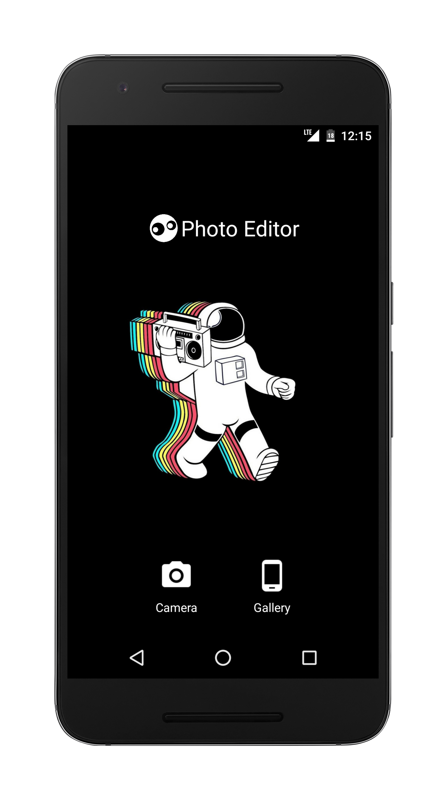
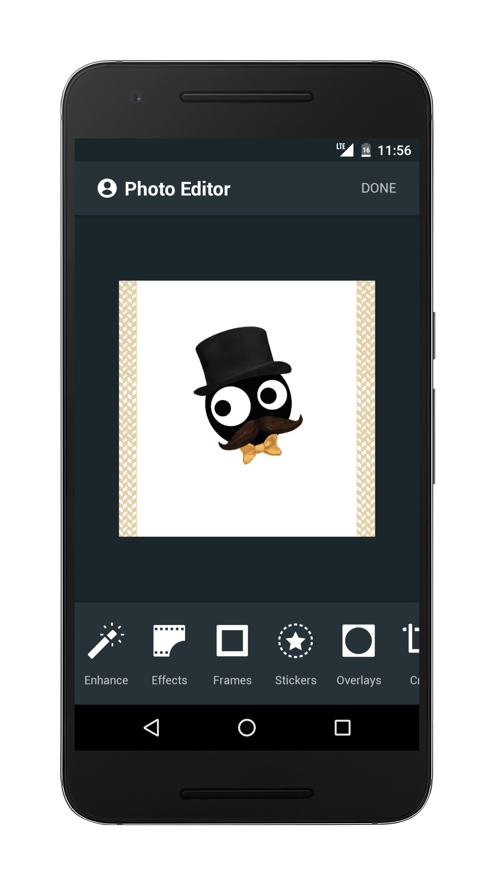

# Photo Editor

*A simplified photo editing application*

Alienator is a simple image editing android application, that makes use of [Adobe CSDK](https://creativesdk.adobe.com/) for its powerful photo editing features. In order to run the application, you need to create and register your application at [Creative SDK](https://creativesdk.adobe.com/docs/android/#/articles/gettingstarted/index.html) website. After registering the application, Adobe provides the following credentials that needs to be replaced in ``` MainApplication.java ```.
- Creative SDK Client ID
- Creative SDK Client Secret
- Creative SDK Redirect Uri

### Screenshots



